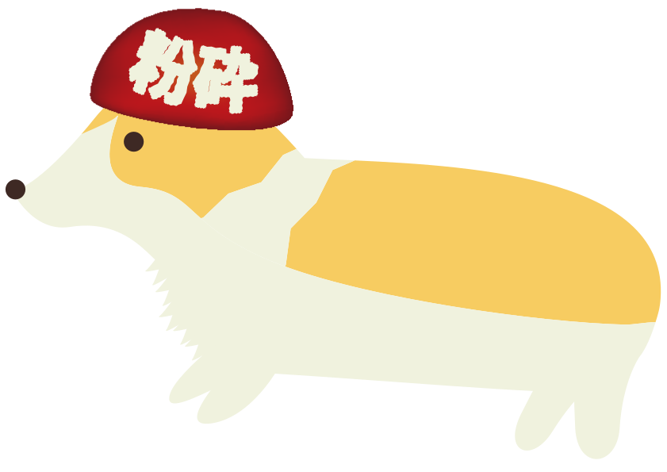

# danko-cogi



<a rel="license" href="http://creativecommons.org/licenses/by-sa/3.0/"></a><br />This artwork is licensed under a <a rel="license" href="http://creativecommons.org/licenses/by-sa/3.0/">Creative Commons Attribution-ShareAlike 3.0 Unported License</a>.

## development

requirement: node > 8

```shell
$ cp .envrc.sample .envrc
$ git clone git@github.com:kamataryo/danko-cogi.git
$ cd danko-cogi
$ npm install
$ npm start
```
